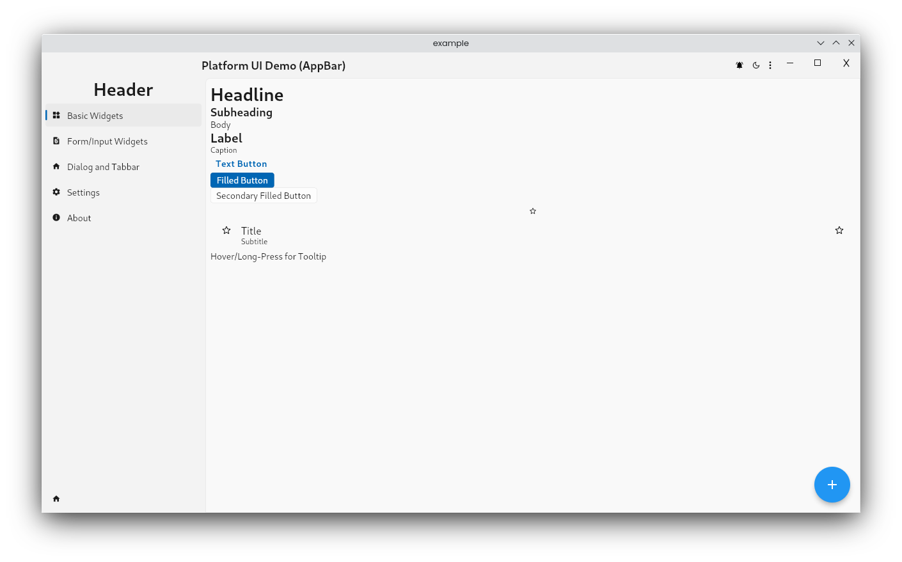
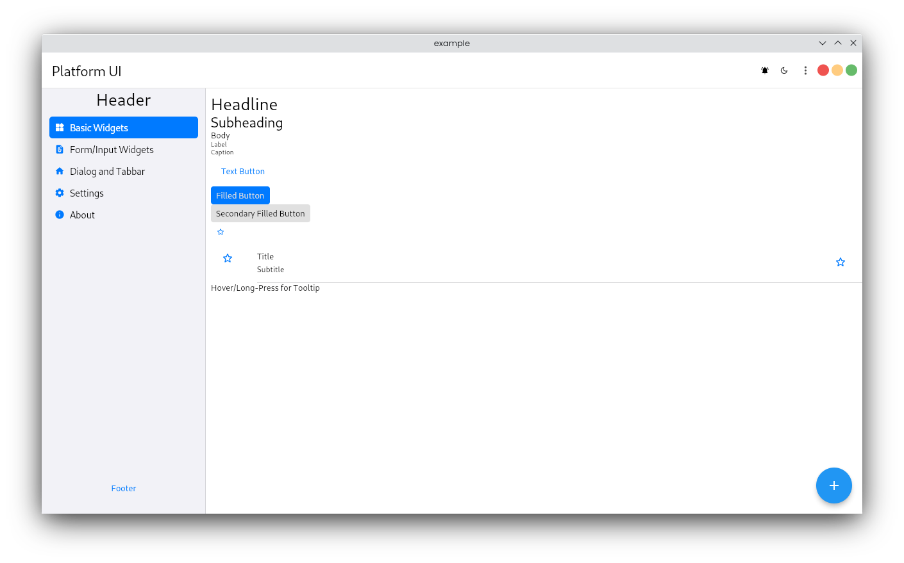
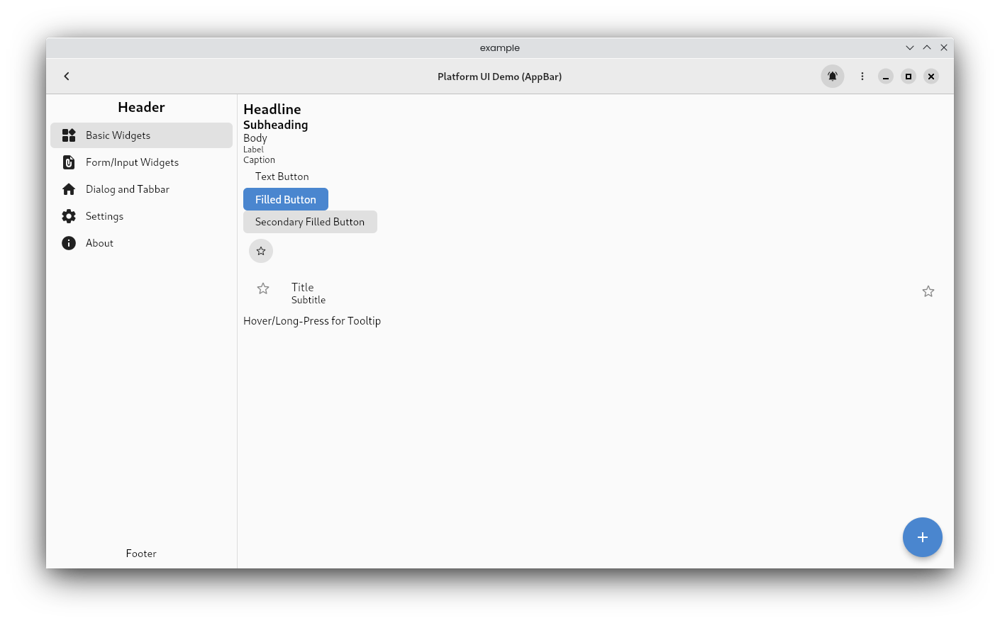
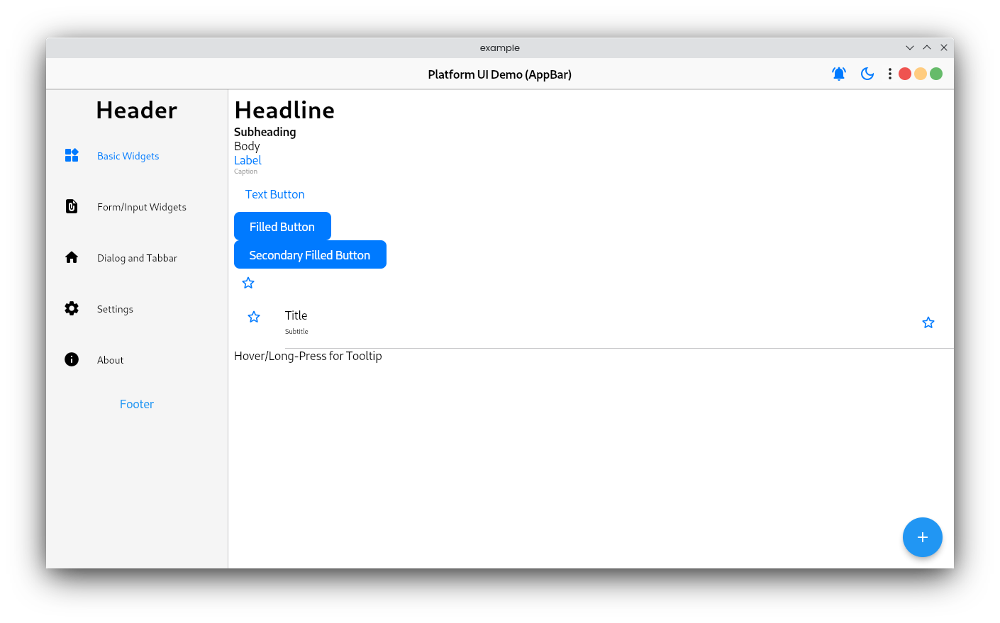
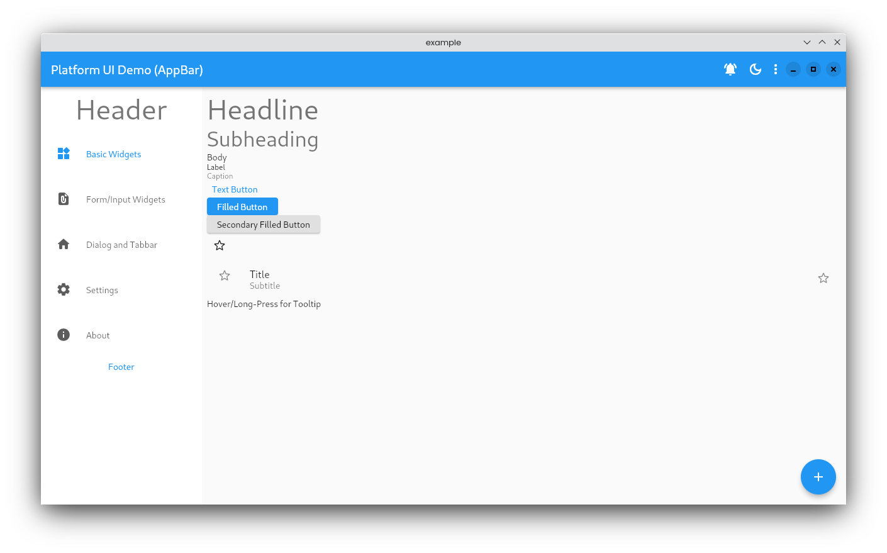

# Platform UI

Flutter platform specific UI widgets

It mimics the native UI widgets (android, iOS, macOS, linux and windows) as much as possible in Flutter & has a wide collection of platform specific widgets. The names and APIs are similar to Flutter's Material UI widgets to make the Flutter developer feel at home. It's utilizes:
- [fluent_ui](https://pub.dev/packages/fluent_ui) for windows
- [macos_ui](https://pub.dev/packages/macos_ui) for macOS
- [Material UI/You](https://m3.material.io/) for android
- [Cupertino](https://docs.flutter.dev/development/ui/widgets/cupertino) for iOS
- [libadwaita](https://pub.dev/packages/libadwaita) for linux

## Feature Highlights
- Simple and customizable platform specific UI widgets
- Supports all major platforms (android, iOS, macOS, linux and windows)
- Exposes the internal API to build widgets on top of it
- Changeable default `TargetPlatform` for overriding platform design in another platform (it's crazy but cool)
- Wide collection of platform specific widgets
- Widget APIs are similar to Flutter's Material UI widgets
- Dark Mode support

## Install

Run following in a terminal:
```bash
$ flutter pub add platform_ui fluent_ui macos_ui libadwaita adwaita
```

## Preview

Windows


macOS


Linux


iOS


Android
